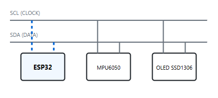

# 🤖 I2C: Inter-Integrated Circuit (The Peripheral Bus)

  
  
  

**I2C** (Inter-Integrated Circuit) acts as the "Local Area Network" for the robot's sensory organs. While UART is a direct pipe between two brains, I2C is a **shared bus** that allows a single Controller (the ESP32) to orchestrate an entire suite of sensors and displays using only two wires.

---

<table width="100%">
  <tr>
    <td width="60%" align="left" valign="middle">
      <h2>📟 Protocol Logic: The Synchronous Dialogue</h2>
    </td>
    <td width="40%" align="center" valign="middle">
      
    </td>
  </tr>
  <tr>
    <td colspan="2">
      

        I2C is a <b>synchronous</b> protocol, meaning it uses a dedicated <b>Clock (SCL)</b> line to tell the receiver exactly when to sample the <b>Data (SDA)</b> line. This eliminates the "Baud Rate" guesswork found in UART but introduces the requirement for unique 7-bit <b>Device Addresses</b>.
      

    </td>
  </tr>
</table>

---

## ⚖️ Strategic Analysis

| Feature | Engineering Implication |
| :--- | :--- |
| **Shared Bus** | Multiple sensors connect to the same two wires, saving GPIO pins on the ESP32. |
| **Master/Slave** | The ESP32 (Master) controls the clock and initiates all communication with sensors (Slaves). |
| **Addressing** | Every device has a unique Hex address (e.g., 0x68). The Master "calls" a specific ID to start a talk. |
| **Open-Drain** | Lines are "pulled high" by resistors. Devices only pull the line LOW to communicate. |

---

## 📦 The I2C Packet Sequence
Every "conversation" on the bus follows a strict hardware handshake to ensure data doesn't collide:

1.  **START Condition:** The Master pulls the SDA line LOW while the SCL line stays HIGH.
2.  **Address Frame:** A 7-bit sequence identifying the target sensor, followed by a Read/Write bit.
3.  **ACK/NACK Bit:** The Slave device pulls SDA LOW to acknowledge it is ready.
4.  **Data Frames:** 8-bit blocks of data (sensor readings or configuration commands).
5.  **STOP Condition:** The Master releases SDA to go HIGH while SCL is HIGH, freeing the bus.

---

## 🛠️ System Implementation
In the **Digital Nervous System**, the I2C bus is dedicated to environment awareness and user feedback:

* **Inertial Measurement (IMU):** The **MPU6050** provides real-time tilt data via I2C to keep the robot balanced.
* **Visual Feedback:** **OLED Displays (SSD1306)** show system status and AI processing states.
* **Servo Expansion:** **PCA9685** drivers occupy the bus to control modular limbs and "eyes."

---

## 🧪 Experimental Design: Pull-ups & Scanning

Our implementation addresses the primary "killers" of I2C communication:
1.  **Pull-up Resistor Logic:** We utilize 4.7kΩ resistors to pull the SDA/SCL lines to 3.3V. Without these, the bus remains "floating" and communication fails.
2.  **Bus Scanning:** The system runs an **I2C Scanner** on boot-up. If the "Eyes" (Pico) or "IMU" (Nano) do not report their Hex address, the AI enters a "Safe Mode" and halts movement.
3.  **Clock Stretching:** We've configured the ESP32 to support clock stretching for slower sensors that need more time to process requests.

---

## 💻 Source Code & Setup

### Physical Wiring (ESP32-S3)
* **SDA (Data):** GPIO 21 (Internal Pull-up enabled)
* **SCL (Clock):** GPIO 22 (Internal Pull-up enabled)
* **VCC/GND:** 3.3V Power rail shared across all sensor modules.

> [!TIP]
> **Address Conflicts:** If using two identical sensors, check the datasheet to change the address (usually by soldering an 'AD0' jumper).

---

<small>© 2026 MatsRobot | Part of the [Digital Nervous System Project](../)</small>
