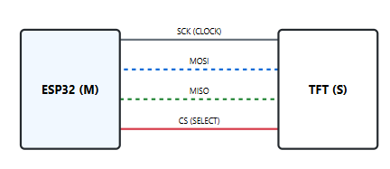

# ⚡ SPI: Serial Peripheral Interface (The High-Speed Highway)

  
  
  

**SPI** (Serial Peripheral Interface) is the fastest synchronous serial protocol in the Digital Nervous System. While I2C is great for simple sensors, SPI is used when we need to push massive amounts of data—such as high-resolution display frames or camera buffers—between the **ESP32-S3** and the **Raspberry Pi Pico**.

---

<table width="100%">
  <tr>
    <td width="60%" align="left" valign="middle">
      <h2>🔌 Protocol Logic: The 4-Wire Performance</h2>
    </td>
    <td width="40%" align="center" valign="middle">
      
    </td>
  </tr>
  <tr>
    <td colspan="2">
      

        SPI is a <b>synchronous</b>, <b>full-duplex</b> protocol. Unlike I2C's shared bus, SPI typically uses a "Chip Select" (CS) line for every peripheral. Because it uses dedicated lines for sending and receiving simultaneously, it can reach speeds of 10MHz to 80MHz+, far exceeding I2C or UART.
      

    </td>
  </tr>
</table>

---

## ⚖️ Strategic Analysis

| Feature | Engineering Implication |
| :--- | :--- |
| **Full-Duplex** | Data flows in (MISO) and out (MOSI) at the same time, doubling effective throughput. |
| **Push-Pull Logic** | Unlike I2C's pull-up resistors, SPI uses active push-pull drivers, allowing for much higher clock speeds. |
| **Chip Select (CS)** | The Controller must pull a specific "CS" pin LOW to talk to a device. This makes wiring complex as you add more devices. |
| **Synchronous** | A shared **SCK (Clock)** line ensures perfect timing; no baud-rate configuration required. |

---

## 📦 The SPI Signal Array
SPI relies on four primary signal lines to maintain its high-speed dialogue:

1.  **SCK (Serial Clock):** Generated by the Controller to synchronize data bits.
2.  **MOSI (Main Out, Sub In):** The path for commands moving from the Controller to the peripheral.
3.  **MISO (Main In, Sub Out):** The path for data returning from the peripheral to the Controller.
4.  **CS / SS (Chip Select):** The signal that "activates" the specific peripheral.

---

## 🛠️ System Implementation
In the **Digital Nervous System**, SPI handles the "High-Bandwidth" tasks:

* **Vision Buffer:** The **ESP32-S3** uses SPI to capture frames from the camera module at high frame rates.
* **Fast Displays:** Driving **TFT LCD screens** where I2C would be too slow to provide smooth animations.
* **Storage:** High-speed data logging to **SD Cards** via the Raspberry Pi Pico's SPI interface.

---

## 🧪 Experimental Design: Signal Integrity

At the high frequencies SPI operates (up to 40MHz in this project), signal integrity becomes a major challenge:
1.  **Short Lead Lengths:** We keep SPI wiring under 10cm. Longer wires act as antennas, creating "ringing" in the clock signal that causes data corruption.
2.  **Clock Polarity (CPOL) & Phase (CPHA):** The experiment involves matching the "SPI Mode" (0, 1, 2, or 3) between the ESP32 and the Pico. If these don't match, the data is shifted by half a bit and becomes unreadable.
3.  **Level Shifting:** Because SPI is so fast, we use **High-Speed Logic Shifters** (74HCT series) rather than standard MOSFET shifters to prevent signal lag.

---

## 💻 Source Code & Setup

### Physical Wiring (ESP32-S3 default)
* **MOSI:** GPIO 13
* **MISO:** GPIO 12
* **SCK:** GPIO 14
* **CS:** GPIO 15 (Can be any digital pin)

> [!TIP]
> **Performance Hack:** On the ESP32, use the `SPIClass` with DMA (Direct Memory Access). This allows the hardware to send image data to a display in the background while the CPU continues to run AI logic.

---

<small>© 2026 MatsRobot | Part of the [Digital Nervous System Project](../)</small>
