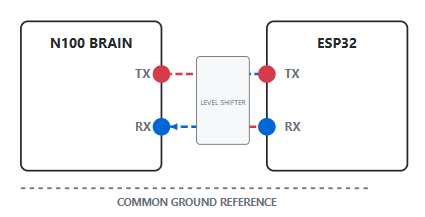

# 📟 UART: Universal Asynchronous Receiver-Transmitter

  
  
  

**UART** serves as the primary "Serial Pipe" for the Digital Nervous System. In this architecture, it establishes a point-to-point bridge linking the high-level intelligence of the **Intel N100 (The Brain)** to the real-time execution of the **ESP32 (Main Controller)**.

---

<table width="100%">
  <tr>
    <td width="60%" align="left" valign="middle">
      <h2>🔌 Protocol Logic: Timing Without a Clock</h2>
    </td>
    <td width="40%" align="center" valign="middle">
      
    </td>
  </tr>
  <tr>
    <td colspan="2">
      

        UART is a hardware communication protocol that exchanges data serially without a shared clock signal. Instead of a dedicated clock wire, it relies on <b>Internal Timing Synchronization</b>. Both devices must be manually configured to the same <b>Baud Rate</b> (speed) and framing parameters to ensure the receiver samples the bits at the correct intervals.
      

    </td>
  </tr>
</table>

---

## ⚖️ Strategic Analysis

| Feature              | Engineering Implication                                                                               |
| :------------------- | :---------------------------------------------------------------------------------------------------- |
| **Asynchronous**     | Timing is handled internally. No clock wire reduces pin count and electromagnetic interference (EMI). |
| **Point-to-Point**   | Strictly for two devices. Data flows over dedicated **TX (Transmit)** and **RX (Receive)** lines.     |
| **Full-Duplex**      | Simultaneous bidirectional communication is possible if separate signal lines are maintained.         |
| **Baud Sensitivity** | If the N100 sends at 115200 and the ESP32 expects 9600, the data appears as corrupted "gibberish."    |

---

## 📦 The Bit-Stream Sequence

Unlike I2C or SPI, UART happens on a single line that sits **Logic High (1)** when idle.

1. **The "Start" Trigger:** The sender pulls the line **Low (0)** for exactly one bit period. This transition is the only reference point the receiver has to wake up its internal timer.
2. **Data Frame:** Usually 8 bits are sent, with the **Least Significant Bit (LSB)** transmitted first.
3. **Middle-Bit Sampling:** To avoid signal noise at the voltage edges (rising/falling), receivers sample the incoming bit at the **50% mark** of the bit period.
4. **Error Checking:** An optional **Parity Bit** provides a simple checksum for corrupted data.
5. **Stop Bit(s):** The sender pulls the line back to **High (1)** for 1-2 bit periods to return to the Idle state.

---

## 🛠️ System Implementation

In this project, UART acts as the **Command Channel**:

- **Brain-to-Body Link:** The **N100** runs Python/AI vision logic and streams target coordinates to the **ESP32** via a USB-to-Serial interface.
- **Bluetooth Bridge:** The **ESP32-C3** handles manual remote control commands via a UART Bluetooth module.
- **Telemetry & Debugging:** The **Arduino Nano** and **Pico** output real-time sensor logs to the serial terminal for system monitoring.

---

## 🧪 Experimental Design: N100 to ESP32

Our setup focuses on high-speed data integrity across mismatched voltage levels:

1. **Voltage Translation:** We utilize a **Bidirectional Logic Level Shifter** to safely bridge the N100's 5V USB logic with the ESP32's 3.3V GPIOs.
2. **Packet Structure:** AI-processed motor vectors are packaged into a structured **10-byte packet**.
3. **Interrupt Handling:** The ESP32 utilizes an interrupt-driven RX buffer. This ensures the robot remains responsive to movement commands even while executing complex motor loops.

---

## 💻 Source Code & Setup

### Physical Wiring

- **N100 TX** → Level Shifter → **ESP32 RX (GPIO 16)**
- **N100 RX** ← Level Shifter ← **ESP32 TX (GPIO 17)**
- **Common Ground:** Vital for providing a reference voltage for the data bits.

> [!IMPORTANT]
> Always implement a non-blocking `Serial.available()` check. If the ESP32 "waits" for data, the entire robot's physical movement will freeze until a packet arrives.

---

<small>© 2026 MatsRobot | Part of the [Digital Nervous System Project](../)</small>
